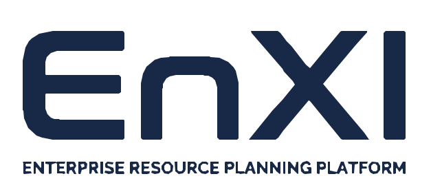
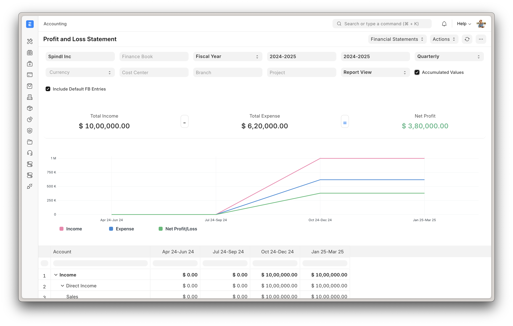

<div align="center">
    <a href="https://github.com/Syedirtiza768/EnXiN">
	
    </a>
    <h2>EnXi</h2>
    <p align="center">
        <p>Powerful, Intuitive and Open-Source ERP</p>
    </p>


</div>

<div align="center">
	
</div>

<div align="center">
	<a href="https://github.com/Syedirtiza768/EnXiN">Repository</a>
	-
	<a href="https://docs.erpnext.com/">Documentation</a>
</div>

## EnXi

100% Open-Source ERP system to help you run your business.

### Motivation

Running a business is a complex task - handling invoices, tracking stock, managing personnel and even more ad-hoc activities. In a market where software is sold separately to manage each of these tasks, EnXi does all of the above and more, for free.

### Key Features

- **Accounting**: All the tools you need to manage cash flow in one place, right from recording transactions to summarizing and analyzing financial reports.
- **Order Management**: Track inventory levels, replenish stock, and manage sales orders, customers, suppliers, shipments, deliverables, and order fulfillment.
- **Manufacturing**: Simplifies the production cycle, helps track material consumption, exhibits capacity planning, handles subcontracting, and more!
- **Asset Management**: From purchase to perishment, IT infrastructure to equipment. Cover every branch of your organization, all in one centralized system.
- **Projects**: Delivery both internal and external Projects on time, budget and Profitability. Track tasks, timesheets, and issues by project.

<details open>

<summary>More</summary>
	
	
	
	
</details>

### Under the Hood

EnXi is built on top of the Frappe Framework, a full-stack web application framework written in Python and Javascript.

## Production Setup

### Self-Hosted
#### Docker

Prerequisites: docker, docker-compose, git. Refer [Docker Documentation](https://docs.docker.com) for more details on Docker setup.

Run following commands:

```
git clone https://github.com/frappe/frappe_docker
cd frappe_docker
docker compose -f pwd.yml up -d
```

After a couple of minutes, site should be accessible on your localhost port: 8080. Use below default login credentials to access the site.
- Username: Administrator
- Password: admin

See [Frappe Docker](https://github.com/frappe/frappe_docker?tab=readme-ov-file#to-run-on-arm64-architecture-follow-this-instructions) for ARM based docker setup.


## Development Setup
### Manual Install

The Easy Way: our install script for bench will install all dependencies (e.g. MariaDB). See https://github.com/frappe/bench for more details.

New passwords will be created for the EnXi "Administrator" user, the MariaDB root user, and the frappe user (the script displays the passwords and saves them to ~/frappe_passwords.txt).


### Local

To setup the repository locally follow the steps mentioned below:

1. Setup bench by following the [Installation Steps](https://frappeframework.com/docs/user/en/installation) and start the server
   ```
   bench start
   ```

2. In a separate terminal window, run the following commands:
   ```
   # Create a new site
   bench new-site erpnext.localhost
   ```

3. Get the EnXi app and install it
   ```
   # Get the EnXi app
   bench get-app https://github.com/Syedirtiza768/EnXiN

   # Install the app
   bench --site erpnext.localhost install-app erpnext
   ```

4. Open the URL `http://erpnext.localhost:8000/app` in your browser, you should see the app running

## Learning and community

1. [Official documentation](https://docs.erpnext.com/) - Extensive documentation for EnXi.
2. [Discussion Forum](https://discuss.frappe.io/c/erpnext/6) - Engage with community of EnXi users and service providers.
3. [Telegram Group](https://erpnext_public.t.me) - Get instant help from huge community of users.


## Contributing

1. [Issue Guidelines](https://github.com/Syedirtiza768/EnXiN/wiki/Issue-Guidelines)
1. [Report Security Vulnerabilities](SECURITY.md)
1. [Pull Request Requirements](https://github.com/Syedirtiza768/EnXiN/wiki/Contribution-Guidelines)


## Logo and Trademark Policy

Please read our [Logo and Trademark Policy](TRADEMARK_POLICY.md).

<br />
<br />
<div align="center" style="padding-top: 0.75rem;">
	<a href="https://github.com/Syedirtiza768/EnXiN" target="_blank">
		
	</a>
</div>
